# 1. Dynamic标定
Dynamic Calibration 只能标定相机的外参，其中采用左相机坐标系作为世界坐标系，

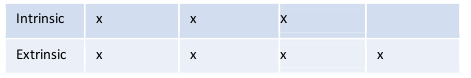
## 1.1. 外参
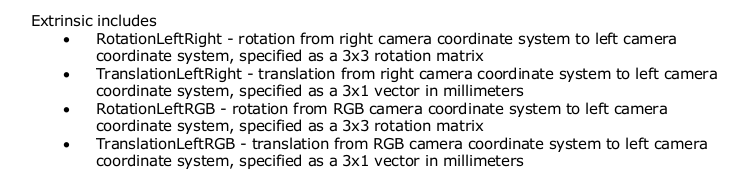

## 1.2. 动态标定类型
1. 校正双目深度相机极线；
2. 深度尺度标定
## 1.3. 安装标定软件
### 1.3.1. 安装依赖库
```
sudo apt-get update
sudo apt-get install libusb-dev libusb-1.0-0-dev
sudo apt-get install libglfw3 libglfw3-dev
sudo apt-get install freeglut3 freeglut3-dev
sudo apt-get install libpng12-dev
```
### 1.3.2. 注册公钥
```
sudo apt-key adv --keyserver keys.gnupg.net --recv-key C8B3A55A6F3EFCDE || sudo apt-key adv --
keyserver hkp://keyserver.ubuntu.com:80 --recv-key C8B3A55A6F3EFCDE
```
### 1.3.3. 添加仓储表
```
sudo add-apt-repository "deb http://realsense-hw-public.s3.amazonaws.com/Debian/apt-repo xenial main" -u
```
### 1.3.4. 删除旧的记录
```
sudo rm -f /etc/apt/sources.list.d/realsense-public.list
sudo apt-get update
```
### 1.3.5. 安装标定包
```
sudo apt-get install librscalibrationtool
sudo apt-get install librscalibrationapi
```
### 1.3.6. 测试安装

```
# 查看版本号
leon@leon-ThinkPad-T430s:/usr/bin$ Intel.Realsense.DynamicCalibrator -v
2.6.8.0
# 是否能检测出设备
leon@leon-ThinkPad-T430s:/usr/bin$ Intel.Realsense.DynamicCalibrator -list
Device Name                   Serial Number       Firmware Version    
Intel RealSense D435I         912112074105        05.11.01.100
255.255.255.255
```
## 1.4. 操作
### 1.4.1. 打印标定板
官方指定target板  
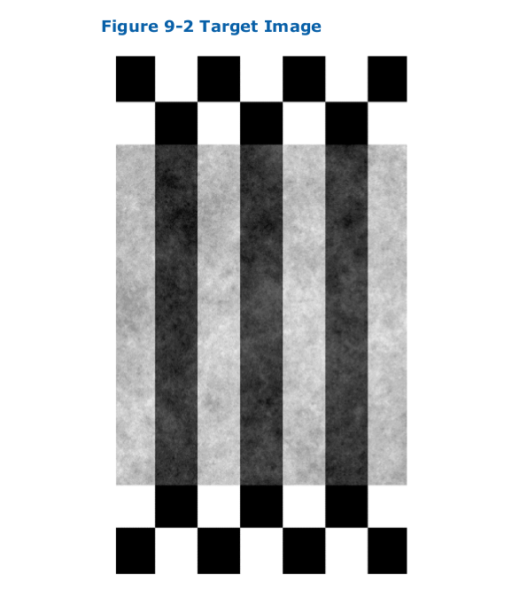  
具体pdf详见附件print-target-fixed-width.pdf
### 1.4.2. 运行dynamic calibrator
```
leon@leon-ThinkPad-T430s:/usr/bin$ ./Intel.Realsense.DynamicCalibrator 
```
按照要求移动相机。

# 2. 用户自定义标定
realsensor深度相机的双目输出的数据是经过校正过的。
在realsensor的ROS包中的源码可以看到如果infra1或infra2相机使能则输出rectified image。
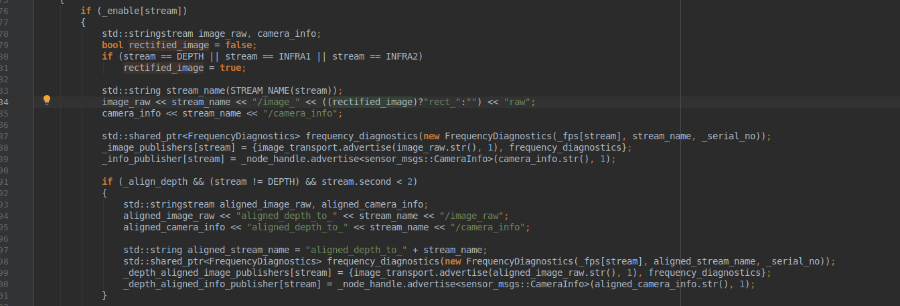
在对相机内参进行标定是则通过修改图像的格式，来改变是否输出原始的图像数据。
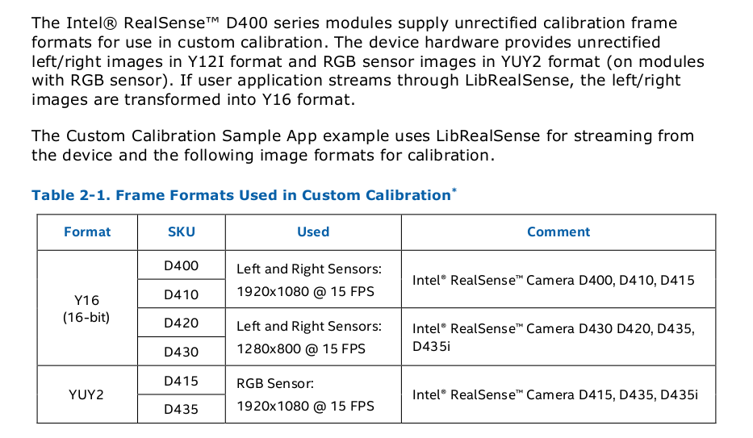
## 获取未标定数据
1. 打开终端运行realsense-viewer，如下图所示：   
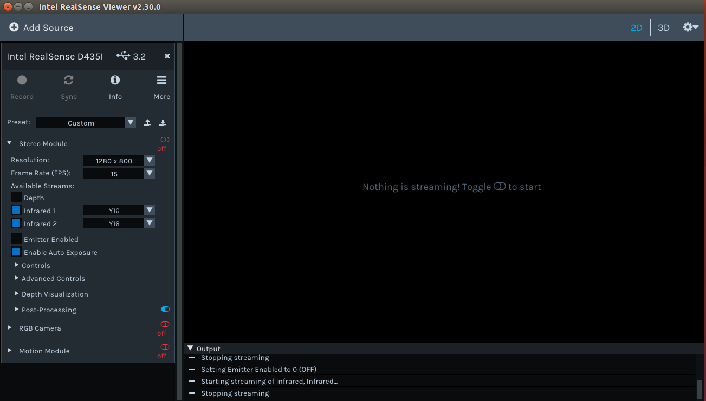

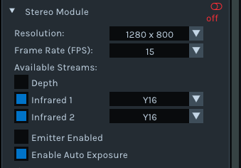  

按照上图进行配置，打开图像  

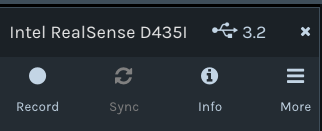  
等图像稳定后，点击GUI左上角Record按钮，此按钮是保存rosbag数据包。默认保存文件目录在~/Document文件夹中。
## 2.1. 内参
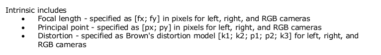
将参数用xml格式的文件写入进去
```
leon@leon-ThinkPad-T430s:/usr/bin$ ./Intel.Realsense.CustomRW
```
## 2.2. 操作示意
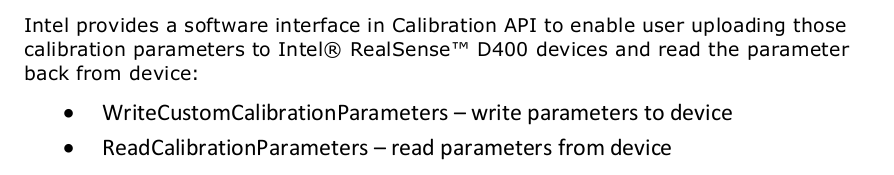
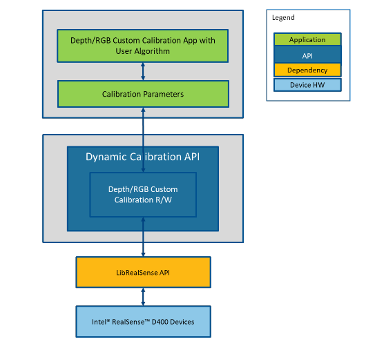
# 3. 标定总结
## 3.1. 相机与相机的外参
有两种方法方法：
1. Dynamic Calibration
2. 用户自定标定方法，比如使用kalibr工具或着使用Opencv。
## 3.2. 相机内参：
1. 官方提供在WIN10系统下的标定例程，是基于opencv的
2. 用户自定标定方法，比如使用kalibr工具或着使用Opencv，matlab等。
## 3.3. imu内参
采用官方提供的标定方法。快捷简单。
## 3.4. 相机与IMU外参
采用kalibr工具。


