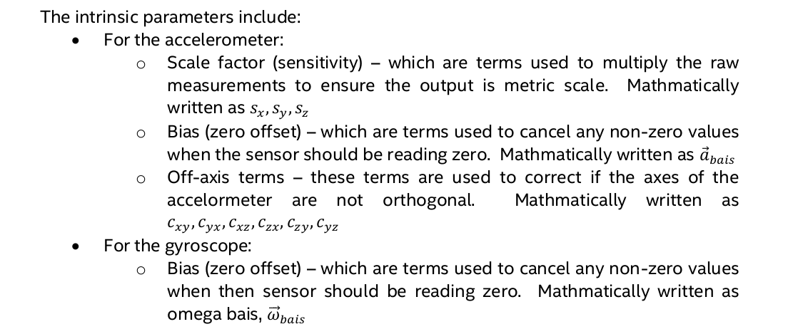
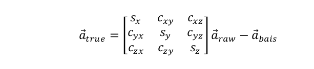
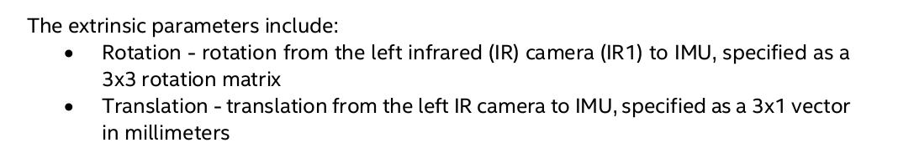

# 1. 内参标定

## 1.1. 误差模型
1. 加速度计

2. 角速度计


## 1.2. 安装python及相关库
```
sudo apt-get install python3
sudo apt-get install python3-pip
sudo pip3 install numpy
```
## 1.3. 安装pyrealsense2
```
sudo pip3 install pyrealsense2
```
## 1.4. 标定py脚本
脚本文件所在位置，在SDK文件夹中
```
/librealsense-2.30.1/tools/rs-imu-calibration
```
## 运行py脚本
```
python rs-imu-calibration
```

# 2. 外参标定
  
官方未提供标定工具，可采用kalibr标定