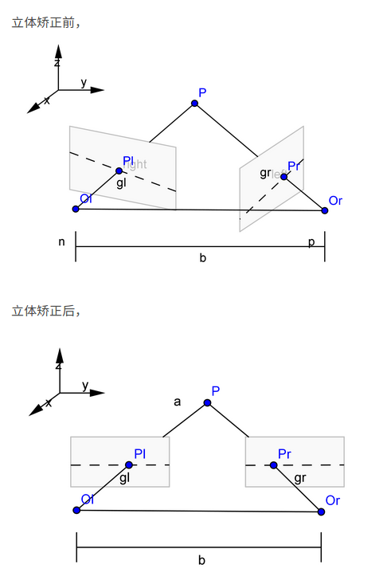

# 1. 安装依赖
按照orbslam文件夹中的readme文件操作。
# 2. 创建ROS工作空间
```
mkdir -p ~/SLAM/src
$ cd ~/SLAM/src
$ catkin_init_workspace
$ cd ..
$ catkin_make
$ echo "source ~/SLAM/devel/setup.bash" >> ~/.bashrc
$ source ~/.bashrc
```
将orbslam源文件复制到src下
# 3. 编译
```
./build_ros.sh
```
# 4. debug
## 4.1. 依赖ros_build
在安装ros时 initialize rosdep失败
执行命令
```
sudo rosdep init
rosdep update
```
有的时候修改系统的python默认版本也会出现这个现象，应该ubunbu 16.04 （kinetic）默认版本是python2.7
## 4.2. 需链接boost库
打开ORB_SLAM2/Examples/ROS/ORB_SLAM2文件夹下的CMakeLists.txt，在set(LIBS ...)中同样添加上述的两个库文件。
```
/usr/lib/x86_64-linux-gnu/libboost_system.so
/usr/lib/x86_64-linux-gnu/libboost_filesystem.so
```
修改以上两条的原因是编译过程中可能会遇到cmake找不到libboost_system.so和libboost_filesystem.so的情况，也许你不会遇到。当然，上面两个库的路径要根据自己的实际情况进行适当修改，可以通过$ locate libboost_system.so来进行定位。

# sterro 
## 立体矫正
要通过两幅图像估计物点的深度信息，就必须在两幅图像中准确的匹配到同一物点，这样才能根据该物点在两幅图像中的位置关系，计算物体深度。为了降低匹配的计算量，两个摄像头的成像平面应处于同一平面。但是，单单依靠严格的摆放摄像头来达到这个目的显然有些困难。立体校正就是利用几何图形变换(Geometric Image Transformation)关系，使得原先不满足上述位置关系的两幅图像满足该条件

