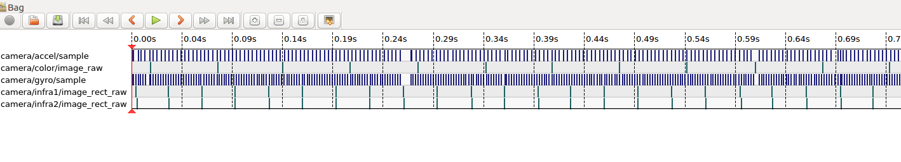
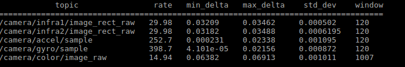

# 1. 同步关系

# 2. 发布频率


# 3. 内置信息
## 3.1. 内参信息
```
/camera/accel/imu_info
/camera/gyro/imu_info
/camera/color/camera_info
/camera/depth/camera_info
/camera/infra1/camera_info
/camera/infra2/camera_info
```
## 3.2. 外参信息
```
/camera/extrinsics/depth_to_color
/camera/extrinsics/depth_to_infra1
/camera/extrinsics/depth_to_infra2
```