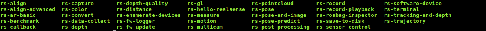
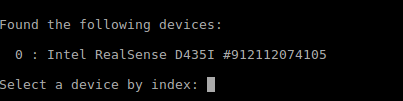
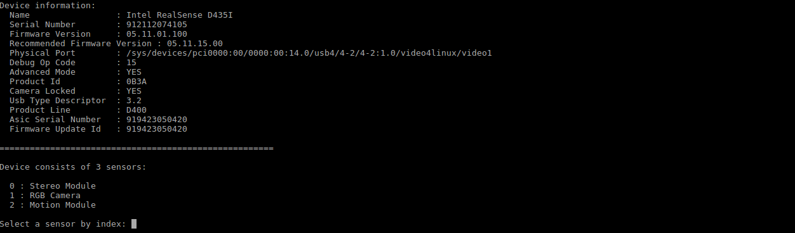
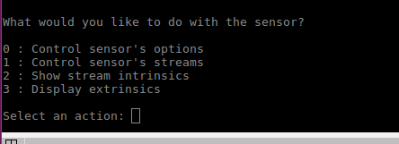
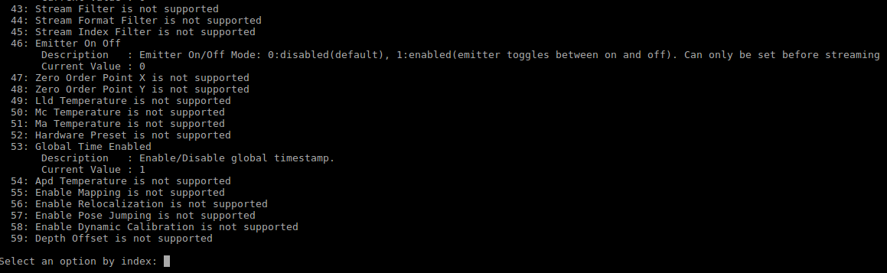
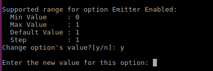

# 1. 说明
官方提供了一些工具供用户使用，当安装好libsensorSDK后，在/usr/bin文件夹中可看到一下工具


# 2. 修改相机参数
使用 rs-sensor-control，根据提示修改相应参数。
## 2.1. 关闭红外投射
```
//打开terminal 运行命令
rs-sensor-control
```
  
输入0然后按回车键  

  

选择Stereo Module 输入0。  

  

输入0，选择control sensor's options，在终端会输出各个参数选项的id及描述。  

  

输入18，emitter enabled。  

  

如果需要关闭红外投射则输入0。
# 3. 查看相机配置信息
rs-enumerate-devices
可以查看相机图像能配置的分辨率列表。

