# 1. 工作原理
通过红外点阵投射器透射光斑，在低纹理的环境中提供红外图案以提高双目匹配的精度。通过左右红外相机接收得到的红外图像，再用双目测距原理测距。进行匹配计算深度图视差图等数据。RGB相机获得彩色图像。    

# 2. 系列参数对比
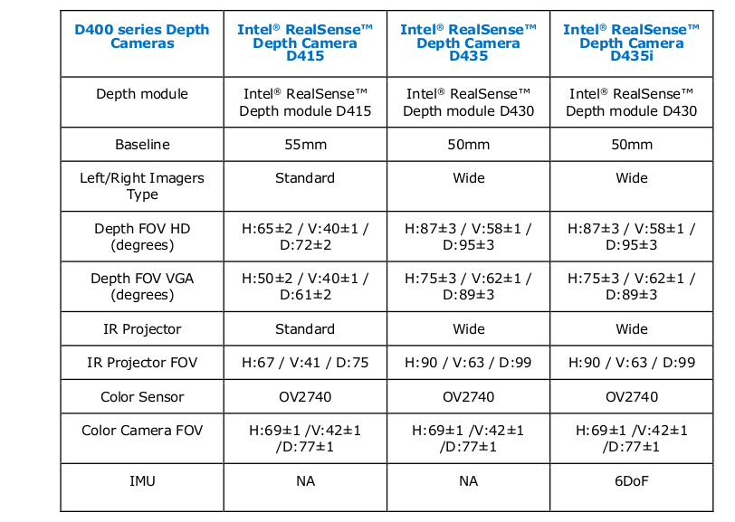

# 3. 测距原理
左右图像通过双目视差解算深度
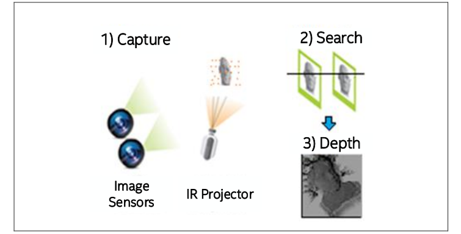
# 4. 器件规格
## 4.1. RGB相机
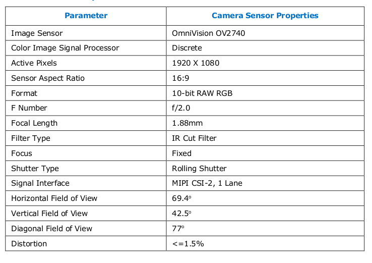
## 4.2. 深度模块
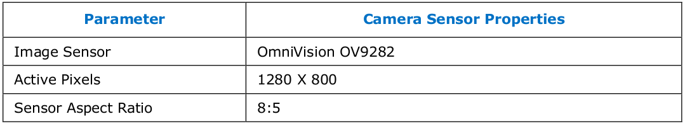
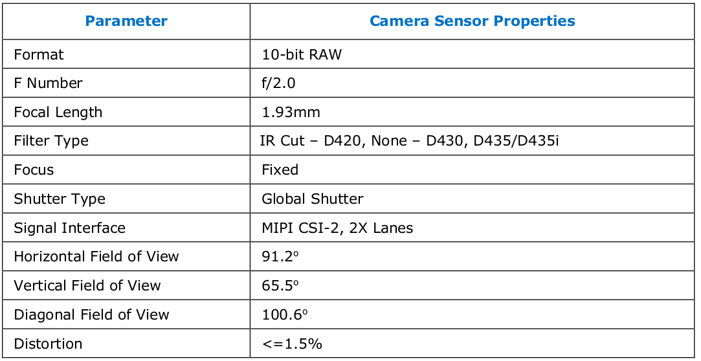
# 5. SDK参数修改
## 5.1. 深度相机
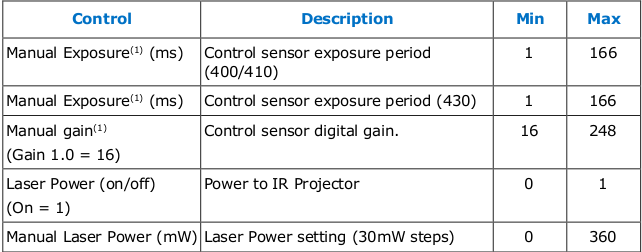
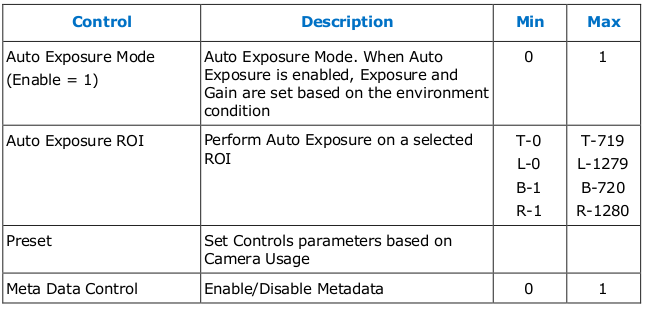
## 5.2. RGB相机
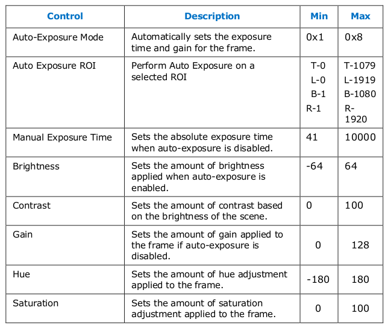
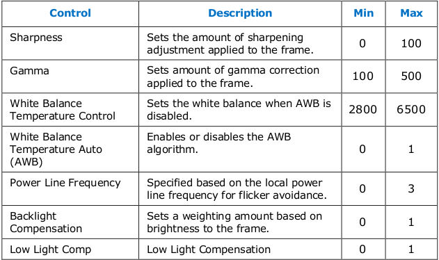

## 5.3. IMU
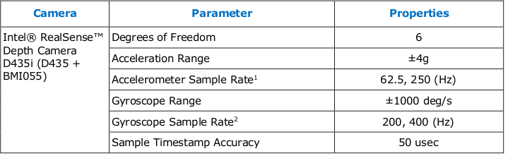
# 6. 辅助工具
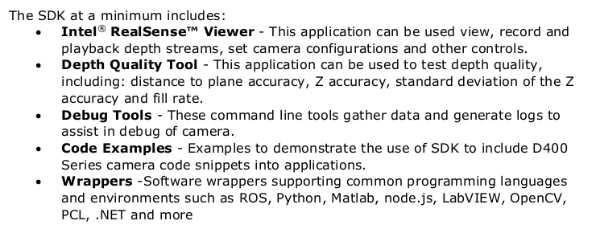
